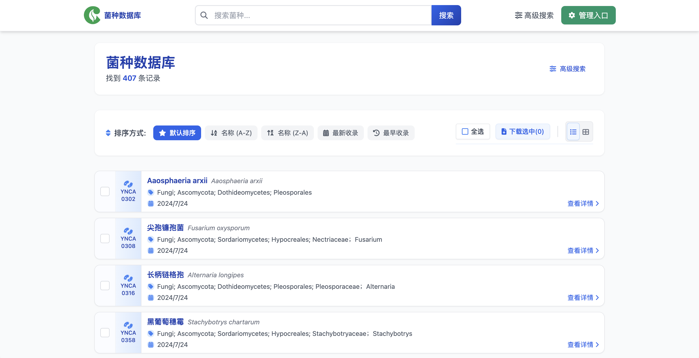
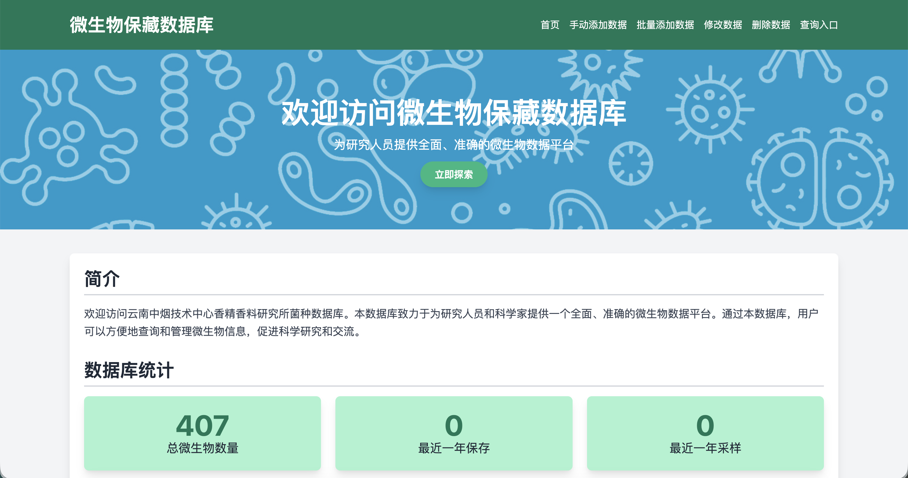

<div align="center">


# DianStrain

**Microbial Strain Database for Yunnan China Tobacco R&D Center**


</div>

---

## Features

- 🔍 Multi-dimension advanced search with AND/OR logic
- 📊 Batch CSV import & export
- 🧬 Genome sequence file management (FASTA, GenBank, GFF3)
- 🗂️ Freezer location hierarchy tracking
- 💻 Desktop GUI control center (PyQt6)
- 🔐 Admin authentication & CRUD operations

## Screenshots

<div align="center">

<p><em>Desktop GUI Control Center</em></p>
</div>

<br>

<div align="center">

<p><em>Search Results with Grid/List View</em></p>
</div>

<br>

<div align="center">

<p><em>Admin Management Panel</em></p>
</div>

## Quick Start

```bash
# Install dependencies
pip install -r requirements.txt

# Run the application
python app.py

# Or use the Windows launcher
run.bat
```

Access at `http://127.0.0.1:5001`

## Tech Stack

Flask · SQLAlchemy · SQLite · PyQt6 · Tailwind CSS · jQuery · Chart.js

## License

Internal Use Only
